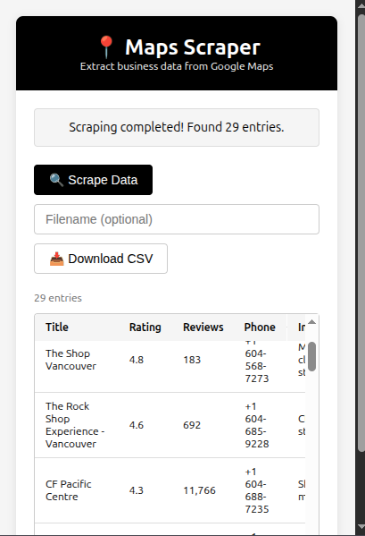

# 🗺️ Google Map Scraper Extension

A simple Chrome extension to scrape business listings from Google Maps and export them as CSV or JSON.

## ⚙️ How to Install

1. Download or clone this repo.
2. Open Chrome and go to `chrome://extensions/`.
3. Turn on **Developer mode** (top right).
4. Click **Load unpacked** and select this project folder.

## 🧪 How to Use

1. Go to [Google Maps](https://maps.google.com) and search for a place or business type.
2. Click the extension icon.
3. Click **Start Scraping**.
4. Download your data when it’s ready.

